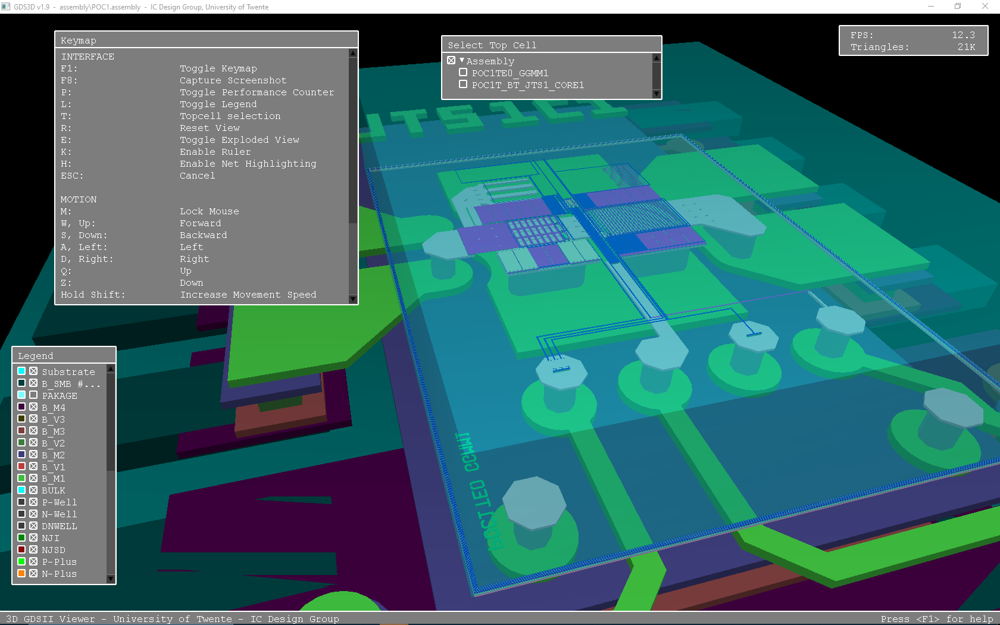
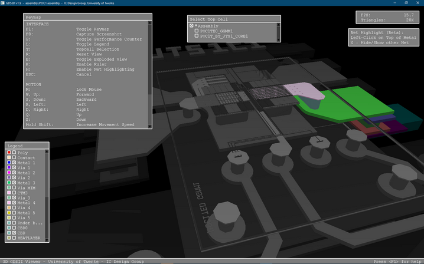

GDS3D - An application used for rendering IC (chip) layouts in 3D.
=
University of Twente, Integrated Circuit Design Group
http://www.icd.el.utwente.nl/

An other repo (https://github.com/skuep/GDS3D) as the same source and add few improvement like compression with server/client process. 

This release add two major add featurs : assembly and export 3D model for GMSH. 
Assembly: this mean it’s possible to merge multi GDS (with different technologies)
I also try to improve highlight net. 

Contents:
1. Introduction
2. Command line parameters
3. Process definition files
4. Using the program

   4.1 Controlling Movement
   
   4.2 Interface Elements
   
       4.2.1 Legend
       4.2.2 Rulers
       4.2.3 Topcell Selection
       4.2.4 Performance Counter
       4.2.5 Exploded View
       
5. Cadence Integration

   5.1 Basic Setup
   
   5.2 Advanced Setup
   
   5.3 Recommendations
   
6. Compiling the Code
7. Keymap
8. Contact Information

1. Introduction

GDS3D is an application that can interpret so called IC layouts and render them in 3D. The program accepts standard GDSII files as input data. Along with the layout file, it requires a so called process definition file which contains the 3D parameters of the process being used. These files combined allow the program to create a 3D representation of the layout, where the user has full, real time control over the camera position and angle, much like in a 3D video game.

2. Command line parameters

The program can be started from a command line using the following syntax:

        GDS3D -p <process definition file> -i <GDSII file> [-t <topcell>] [-f] [-u] [-h] [-v]
Or

        GDS3D -a <assembly definition file> [-t <topcell>] [-f] [-u] [-h] [-v]

Required parameters:

        -p      Process definition file
        -i      GDSII file
Or

        -a      Assembly definition file

Optional parameters:

        -t      Top cell, will default to top-most cell in GDS if omitted
        -f      Start in full screen mode
        -u      Disable GDS file monitoring, prevents updating the 3D view if the GDSII file is changed
        -v      Verbose output
        -h      Display command-line help

The program can be run in Windows, Linux and MacOS, and each OS has its own executable. The locations of the executables are:

        Windows:    <Program folder>\win32\GDS3D.exe
        Linux:      <Program folder>/linux/GDS3D
        MacOS:      <Program folder>/mac/GDS3D

There are also run scripts for each OS that will load an example GDSII file in a mock-up process. These files are:

        Windows:    <Program folder>\RunWin32.cmd
        Linux:      <Program folder>/RunLinux.sh
        MacOS:      <Program folder>/RunMac.command

3. Process definition files

The process definition files contain the physical properties of the process being used, as well as color mappings for each layer. These files are simply text files listing every layer in the process along with its properties. An example layer, taken from the mock-up process that comes with the program, is defined as follows:

        LayerStart: Metal 1       # Start tag and layer name as it will appear in the legend
        Layer: 7                  # GDSII layer number     
        Datatype: 0               # GDSII layer data type           
        Height: 620               # Start height (usually in nm)
        Thickness: 150            # Thickness (usually in nm)
        Red: 0.00                 # Red color component (0.0-1.0)
        Green: 0.00               # Green color component (0.0-1.0)
        Blue: 1.00                # Blue color component (0.0-1.0)
        Filter: 0.0               # Transparency (do not use)
        Metal: 1                  # Metal clickable in net highlighting mode (0 for VIA)
        Shortkey: 1               # Shortcut to toggle layer visibility
        Show: 1                   # Set to 0 for layers that are not to be rendered
        Virtual: 10 AND 11        # Define a new layer where 10 AND 11 exist     
        Material: Al              # Define Material of layer for gmsh output only
        OutMaterial: SiO2         # Define OutMaterial of layer for gmsh output only
        MinSpace: 350             # Define Minimum space to merge via for gmsh output only   
        LayerEnd                  # End tag

The first layer in the file is the substrate and must always be present. Its layer number is always 255 and it is the only layer for which a filter value other than 0.0 is advised (0.5 works well here). Comments can be added to the definition file by pre-pending them with #.

Toggling layer visibility while the program is running can be easily achieved by setting a shortkey for a layer. These shortkeys can be any numerical key (0-9). Modifier keys can also be used, by pre-pending the shortkey with (a combination of) <Alt>, <Ctrl> and <Shift>.

One extra option can be added to a layer, which is "Datatype". This can normally be omitted, as most in processes different datatypes with the same layer number do not mean physically different layers. However, the developers have heard of one case where N-Well and P-Well "layers" actually had the same layer number but different datatypes. In such an event one can specify two layers with the same layer number but differing datatypes to render these layers in, for example, different colors.

4. Using the program

4.1 Controlling Movement

When the program is running, it is possible to move the camera around using the classical 3D-game controls, the A,W,S,D (or the arrow) keys. The Q and Z keys are used to move the camera up and down and the R key can be used to reset the view.

Initially the program has a traditional mouse cursor. In this mode the user can rotate the view by pressing the left mouse button and dragging the mouse to the left or right to rotate the view, and up or down to tilt the view. Dragging the mouse while holding the right mouse button will strafe the view for left or right motion, and move forwards or backwards for up or down motion. Finally, the scroll wheel can be used to move up or down.

By pressing the M key, the program switches to mouse control mode. In this mode the mouse can be used to rotate and tilt the camera much like in a 3D-game. The scroll wheel can still be used to move up and down.

4.2 Interface Elements

4.2.1 Legend

The program contains a legend, which can be toggled with the L key, from where the visibility of each layer can be toggled.
Another way to show or hide layers is by pressing the control key and scrolling the mouse wheel. Scrolling up will hide the last visible layer (basically stripping away layers from the top with each �click�) and scrolling down will un-hide the last hidden layer. By using the alt instead of the control key, the same procedure can be used, except it will start from the bottom up.
The third and final way in which the user can toggle layer visibility if by using shortkeys defined in the process definition file.

4.2.2 Rulers

It is also possible to create a ruler, by pressing the K button. A red plane will appear in the layout. You can click with the left mouse button on points on the plane to define the ruler. To measure in a different layer, hold the CTRL key and scroll with your mouse wheel.

4.2.3 Topcell Selection

By pressing the T key the user can bring up a list of all the cells in the GDSII file. By clicking one of these cells it will become the "top cell", meaning only it and its sub-cells will be rendered. The cells in this window are hierachically ordered, click on the triangles to open up new hierarchy levels.

4.2.4 Performance Counter

The P key brings up a performance counter. This counter shows the number of frames per second, as well as the number of triangles being rendered at a given moment.

4.2.5 Exploded View

Pressing the E key will "explode" the view. This means the starting height of each layer will be multiplied by a constant value, basically creating gaps between the layers. This can for example be useful when viewing fringe capacitances.

4.2.6 Net Highlighting (Tracing)

Pressing the H key will start net tracing mode. The layout will turn grey and you can now left-click on the top of a metal to trace it. Only the trace will have color, making it easy to follow a line. Note that tracing ground and power lines can take a long time, press ESCAPE at any time to interrupt the tracing. In order for tracing to work properly, the process definition file must have the Metal parameter set to 1 for all metal layers (but NOT for VIA's). The tracer expects that the height and thickness of the layers are adjacent and that metals and via's alternate in the metal stack.

5. Cadence Integration

5.1 Basic Setup

A skill script is included with the source to enable integration of GDS3D into Cadence, it is located in the skill subfolder. This script is designed to be loaded at Cadence startup, it will automatically export GDS files from layout into a temporary location on the user's workspace and modify the run scripts to run GDS3D with the exported GDS and correct process definition file.

First, put all of the GDS3D files on a server accessible to the users. In our case, this is at:

	/cadappl/ictools/3D_viewer/GDS3D_1.8/
	
Next, open the icdGDS3D.il skill script in the skill subfolder and change the GDS3D_SRC variable into the path where you have put GDS3D. This way the script knows its own location.

After starting Cadence for the first time, load this script by entering something like this:

	load("/cadappl/ictools/3D_viewer/GDS3D_1.8/skill/icdGDS3D.il")
	
into your Virtuoso window. A new ICD-Tools menu-item has been added in the Virtuoso screen with items:

	Layout -> GDS3D
	Run GDS3D

Open a layout view from one of your favourite libraries and click on the Layout -> GDS3D menu-item. You will get an error message now about a missing process definition file. The script will look at the technology file attached to your layout in Cadence and assume there is a corresponding process definition file in the techfiles subfolder. So copy the example file and modify it to correspond to your process. 

With the correct process definition file in place, export again and a new folder will appear in your user workspace:

	~/GDS3D/
	
It contains the appropriate run scripts and gds file to run GDS3D with the layout you just exported. You can run these scripts directly, or use the Run GDS3D item in the ICD-Tools menu. The viewer will now start up and show the layout in 3D. It is of course a good idea to load icdGDS3D.il from your own startup scripts so that it is always available for your users.

In the skill script, the GDS3D_DST variable dictates where these temporary files are put. There is also a GDS3D_LOCAL_COPY variable, which when set to true will copy the executables and techfiles to the user workspace as well. This will allow you to run the viewer without needing server access (works create with SMB over a windows network).

5.2 Advanced Setup

In some cases there might be problems with the GDS exporting in Cadence 5 (Cadence 6 looks good so far). This is because some design kits have convoluted ways of exporting GDS files, especially with specifying layermap files. If this is the case, follow these instructions.

In the ICFB window, choose File->Export->Stream to stream out a GDS file in the way that your design kit requires. Make sure that in the Stream Out Options, the Convert PCells to Geometry is enabled! This will flatten PCells and is essential for getting good FPS out of the viewer.

Please check if you can manually load in the exported GDS into GDS3D by using the commandline parameters. If this is okay, save a Template File from the Stream Out window. Rename this file to have the same name as your process definition file, but with the .template extension instead of the .txt extension and put it in the techfiles subfolder.

Use Layout->GDS3D from the ICD-Tools menu again to test the new setup. The skill script will detect the template file and stream out using these settings, instead of the default settings.

5.3 Recommendations

For a smooth experience, we have some recommendations for your hardware and software setup.

First of all, make sure your clients have installed the latest video drivers. Out-of-the-box Windows drivers are NOT good enough, please go to your graphics card manufacturer's website for drivers. Almost any ATI/AMD or NVidia card is good enough, Intel on-board graphics suck in general.

If your clients run Linux and are connected to the Cadence server with X Window, there is not much you have to do to get Cadence integration running. Just make sure that GLX is installed on your server and clients. You can check this by running the glxinfo and glxgears commands in a terminal. The OpenGL version must be 1.5 or higher to make full advantage of the high speed rendering in GDS3D. 

If your clients are running Windows and you are looking for a X Windows client, we recommend Exceed 3D with the latest service packs, as it is optimized for 3D rendering.

Thin clients working with NX Machine or VNC are not suitable, as they render graphics on the server and transfer pixels only. In this case, you can try to set the GDS3D_LOCAL_COPY variable to true, and access your workspace through SMB or FTP and run the viewer locally.

6. Compiling the Code

The compiled executables delivered in the packages should work on Windows XP, OS X Snow Leopard, Linux Kernel 2.5, and higher. If you are having difficulties, you can recompile the source.

For Windows:
- Get Visual Studio 
- Open win32/GDS3D.sln
- Build in Visual Studio 
- Clean up by removing the Release and Debug folders in win32

For Linux:
- Depending on your distribution, make sure you have installed the development packages of G++, GL, GLU, GLX and X11. (It helps to install G++ 4.5 or higher)
- On Ubuntu, these are: g++, libgl1-mesa-devel, libglu1-mesa-devel and libx11-dev
- Open a terminal to the GDS3D path
- Run: make -C linux
- To clean, run: make -C linux clean

For Mac OS:
- Install Xcode 8.3.2
- Open mac/GDS3D.xcodeproj
- Build in Xcode
Or:
- Install any version of Xcode
- Open a terminal to the GDS3D path
- Run: make -C mac
- To clean, run: make -C mac clean
 
7. Keymap

Interface: 
F1:                 Toggle Keymap
F8:                 Take Screenshot
P:                  Toggle Performance Counter
L:                  Toggle Legend
T:                  Topcell selection
R:                  Reset View
E:                  Toggle Exploded View
F:                  OutPut to gmsh (geo File)
K:                  Enable Ruler
H:                  Enable Net Highlighting
ESC:                Cancel

Motion:
M:                  Lock Mouse
W, Up:              Forward
S, Down:            Backward
A, Left:            Left
D, Right:           Right
Q:                  Up
Z:                  Down
Hold Shift:         Increase Movement Speed

Mouse Special:
Hold Left Button:   Rotate
Hold Right Button:  Walk and Strafe
Wheel Up/Down:      Move Up/Down
<Alt> Wheel Up:     Show First Invisible Layer
<Alt> Wheel Down:   Hide First Visible Layer
<Ctrl> Wheel Up:    Hide Last Visible Layer / Change Ruler Layer
<Ctrl> Wheel Down:  Show Last Invisible Layer / Change Ruler Layer

8. Contact Information

If you are having difficulties running this program, don't hesitate to contact me for free support through the GitHub website:

https://github.com/trilomix/GDS3D

Trilomix
